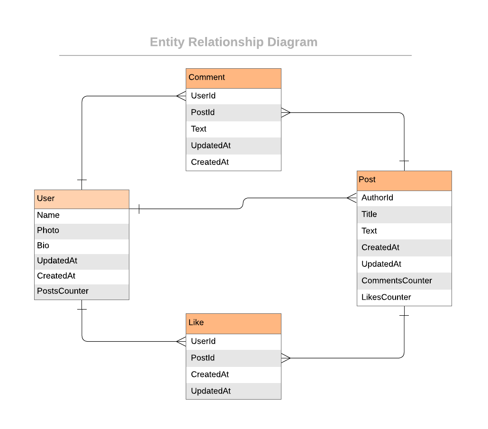

<a id="readme-top"></a>

<div align="center">
  <h1><b>BlogApp | Ruby on Rails Project</b></h1>
</div>

<!-- TABLE OF CONTENTS -->

<summary><h1>📗 Table of Contents</h1></summary>
  <ul>
    <li><a href="#about-project">📖 About the Project</a>
      <ul>
        <li><a href="#built-with">🛠 Built With</a></li>
        <li><a href="#tech-stack">Tech Stack</a></li>
        <li><a href="#key-features">Key Features</a></li>
      </ul>
    </li>
    <!-- <li><a href="#live-demo">🚀 Live Demo</a></li> -->
    <li><a href="#getting-started">💻 Getting Started</a>
      <ul>
        <li><a href="#setup">Setup</a></li>
        <li><a href="#prerequisites">Prerequisites</a></li>
        <li><a href="#install">Install</a></li>
        <li><a href="#usage">Usage</a></li>
        <li><a href="#run-tests">Run tests</a></li>
        <li><a href="#deployment">Deployment</a></li>
      </ul>
    </li>
    <li><a href="#authors">👥 Authors</a></li>
    <li><a href="#future-features">🔭 Future Features</a></li>
    <li><a href="#contributing">🤝 Contributing</a></li>
    <li><a href="#support">⭐️ Show your support</a></li>
    <li><a href="#acknowledgements">🙏 Acknowledgements</a></li>
    <li><a href="#license">📝 License</a></li>
  </ul>

---

<!-- PROJECT DESCRIPTION -->

# 📖 Blog App <a id="about-project"></a>

**Blog App** is a Ruby on Rails-based project design for creating and managing a fully functional blog website. It allows users to create, edit, and delete posts. It also allows users to comment on posts and to like them.

These classes where made following this ERD diagram:
 

<br>

---

## 🛠 Built With <a id="built-with"></a>

### Tech Stack

The project is built using the following technologies:

* Ruby on Rails.
* PostgreSQL.
* RSpec.
* Rubocop.
* Stylelint.

<br>

---

<!-- Features -->

### Key Features

- [ ] Create, edit, and delete posts.
- [ ] Comment system to interact with posts.
- [ ] Like and dislike posts.
- [ ] User authentication and authorization.
- [ ] Responsive design.

Please note: Each feature will be marked with an "x" when it is fully implemented and operational.

<p align="right">(<a href="#readme-top">back to top</a>)</p>

<!--
---

## 🚀 Live Demo <a name="live-demo"></a>
<br>

- Unfortunately, there is no live demo available for this project at the moment.

<p align="right">(<a href="#readme-top">back to top</a>)</p>
-->

---

<!-- GETTING STARTED -->

## 💻 Getting Started <a id="getting-started"></a>

To get a local copy up and running, follow these steps.

### Prerequisites
In order to run this project you need to have:

- Installed Ruby and Ruby on Rails.
- If you're using Windows, have installed WSL.
- If you're using MacOS, an option is using UTM.

### Setup
To clone this repository to your desired folder, run the following command: <br>

```
git clone git@github.com:Ruthmy/blog-app.git
```

Navigate to the cloned repository and run the following command to install the necessary gems:
```
cd blog-app
bundle install
```

<p align="right">(<a href="#readme-top">back to top</a>)</p>

### Usage
Initialize it with
```
rails server
```
Then open `http://localhost:3000` in your browser.

<p align="right">(<a href="#readme-top">back to top</a>)</p>

### Test
To run the tests try the following command:
```
rspec spec
```

<p align="right">(<a href="#readme-top">back to top</a>)</p>

---

<!-- AUTHORS -->

## 👥 Authors <a id="authors"></a>

👤 **Ruth Abreu**

- GitHub: [@Ruthmy](https://github.com/Ruthmy)
- Twitter [@rury_exe](https://twitter.com/rury_exe)
- LinkedIn: [LinkedIn](https://linkedin.com/in/ruth-abreu)

👤 Pablo Bonasera
- Github: [@PabloBona](https://github.com/PabloBona)
- Linkedin: [Pablo Bonasera](https://www.linkedin.com/in/pablo-bonasera/)


<p align="right">(<a href="#readme-top">back to top</a>)</p>

---

<!-- FUTURE FEATURES -->

## 🔭 Future Features <a id="future-features"></a>

- [ ] Search functionality for locating specific articles.
- [ ] User profiles with customizable avatars.
- [ ] Article categories and tagging.
- [ ] Rich text editor for formatting articles.
- [ ] Social media sharing options for articles.
- [ ] API endpoints for external integrations.

<p align="right">(<a href="#readme-top">back to top</a>)</p>

---

<!-- CONTRIBUTING -->

## 🤝 Contributing <a id="contributing"></a>

Contributions, issues, and feature requests are welcome!

Feel free to check the [issues page](https://github.com/Ruthmy/blog-app/issues).

<p align="right">(<a href="#readme-top">back to top</a>)</p>

---

<!-- SUPPORT -->

## ⭐️ Show your support <a id="support"></a>

If you like this project and know someone who might find it helpful, please share it.
Or give it a **star** ⭐️ if you like this project!

<p align="right">(<a href="#readme-top">back to top</a>)</p>

---

<!-- ACKNOWLEDGEMENTS -->
## 🙏 Acknowledgments <a id="acknowledgements"></a>

I thank Microverse for this fantastic opportunity, and the code reviewers for their advice and time.

<p align="right">(<a href="#readme-top">back to top</a>)</p>

---

<!-- LICENSE -->

## 📝 License <a id="license"></a>

This project is [MIT](./LICENSE) licensed.

<p align="right">(<a href="#readme-top">back to top</a>)</p>
